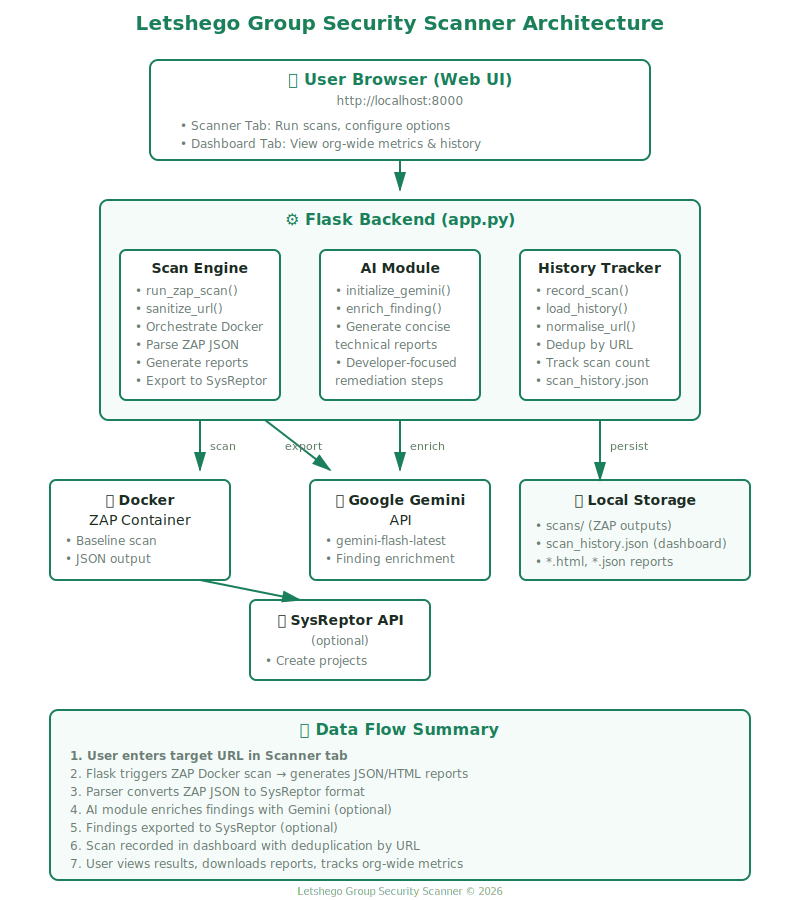

# Letshego Group Security Scanner

A unified web application for automated security scanning with ZAP, AI-powered finding enrichment, SysReptor integration, and vulnerability tracking across your organization.



---

## Features

- **🔍 Automated Scanning** — Run OWASP ZAP baseline scans directly from a web UI
- **🤖 AI Enrichment** — Leverage Google Gemini to generate developer-focused descriptions and actionable remediation steps
- **📤 SysReptor Integration** — Automatically create projects and push findings to your SysReptor instance
- **📊 Dashboard** — Track vulnerabilities across all scanned URLs with deduplication and historical tracking
- **🎨 Letshego Branding** — Professionally styled UI with Letshego Group brand colors and logo

---

## Architecture

```
┌──────────────────────────────────────────────────────────────────────────┐
│                         User Browser (Web UI)                            │
│                    http://localhost:8000                                 │
└───────────────────────────────┬──────────────────────────────────────────┘
                                │
                                ├─ Scanner Tab
                                │  • Enter target URL
                                │  • Configure AI enrichment & SysReptor export
                                │  • View scan results & download reports
                                │
                                └─ Dashboard Tab
                                   • Organization-wide vulnerability totals
                                   • Per-URL scan history & metrics
                                   • Remove unwanted entries
                                │
                                ▼
┌──────────────────────────────────────────────────────────────────────────┐
│                          Flask Backend (app.py)                          │
│                                                                          │
│  ┌────────────────┐  ┌──────────────┐  ┌──────────────────────────┐   │
│  │  Scan Engine   │  │  AI Module   │  │   History Tracker        │   │
│  │  run_zap_scan  │  │  enrich_*    │  │   record_scan            │   │
│  │                │  │              │  │   scan_history.json      │   │
│  └────────┬───────┘  └──────┬───────┘  └──────────────────────────┘   │
│           │                  │                                           │
│           │                  │                                           │
└───────────┼──────────────────┼───────────────────────────────────────────┘
            │                  │
            ▼                  ▼
  ┌──────────────────┐   ┌──────────────────┐
  │  Docker          │   │  Google Gemini   │
  │  ZAP Container   │   │  API             │
  │                  │   │  gemini-flash    │
  │  • Baseline scan │   │  • Enrichment    │
  │  • JSON output   │   │  • Summaries     │
  └──────────────────┘   └──────────────────┘

            │
            ▼
  ┌──────────────────────────────────────┐
  │  SysReptor API (optional)            │
  │  • Create projects                   │
  │  • Push findings                     │
  └──────────────────────────────────────┘

            │
            ▼
  ┌──────────────────────────────────────┐
  │  Local Storage                       │
  │  • scans/             (ZAP outputs)  │
  │  • scan_history.json  (dashboard)    │
  └──────────────────────────────────────┘
```

---

## Prerequisites

- **Docker** — ZAP runs in a container ([install Docker](https://docs.docker.com/get-docker/))
- **Python 3.9+** — Flask backend runtime
- **Google Gemini API Key** (optional) — for AI enrichment ([get key](https://aistudio.google.com))
- **SysReptor instance** (optional) — for report export ([SysReptor docs](https://docs.sysreptor.com/))

---

## Installation

### 1. Clone the repository

```bash
git clone https://github.com/Gumbeoketch/scrappy-scanner.git
cd scrappy-scanner
```

### 2. Set up Python virtual environment

```bash
python3 -m venv .venv
source .venv/bin/activate  # On Windows: .venv\Scripts\activate
pip install -r requirements.txt
```

### 3. Configure environment variables

Copy the example file and fill in your credentials:

```bash
cp .env.example .env
```

Edit `.env`:

```bash
# Google Gemini API key (optional — enables AI enrichment)
GEMINI_API_KEY=your-gemini-api-key-here

# SysReptor configuration (optional — enables report export)
REPTOR_API_KEY=your-reptor-api-key-here
REPTOR_SERVER=https://sysreptor.yourcompany.com/
REPTOR_DESIGN_ID=your-design-template-id-here
```

**Note:** If you don't configure Gemini or SysReptor, the scanner will still work — you just won't have AI enrichment or automatic report export.

---

## Usage

### Start the application

```bash
source .venv/bin/activate
python3 app.py
```

The server will start at **http://localhost:5000**

### Scanner Tab

1. Enter a target URL (e.g., `https://example.com`)
2. Optionally enable:
   - **AI enrichment** — generates concise technical descriptions and remediation steps
   - **SysReptor export** — creates a project and pushes findings automatically
3. Click **Start Scan**
4. Wait for ZAP to complete (usually 2-10 minutes depending on target size)
5. View results, filter by severity, and download reports

### Dashboard Tab

- **Organization totals** — cumulative High/Medium/Low/Info counts across all unique URLs
- **Scanned URLs table** — shows each URL with:
  - Number of scans performed
  - Latest severity breakdown
  - First and last scan timestamps
- **Remove entries** — clean up URLs you no longer want to track (scan files are not deleted)

---

## File Structure

```
scrappy-scanner/
├── app.py                 # Flask backend (scanner, parser, exporter, dashboard)
├── templates/
│   └── index.html         # Web UI (tabs, forms, results rendering)
├── images/
│   └── LHL-Logo.png       # Letshego Group branding logo
├── scans/                 # ZAP scan outputs (gitignored)
├── scan_history.json      # Dashboard persistence (gitignored)
├── requirements.txt       # Python dependencies
├── .env                   # Environment secrets (gitignored)
├── .env.example           # Template for .env
└── README.md              # This file
```

---

## Configuration

### Environment Variables

| Variable             | Required | Description                                              |
|----------------------|----------|----------------------------------------------------------|
| `GEMINI_API_KEY`     | No       | Google Gemini API key for AI enrichment                 |
| `REPTOR_SERVER`      | No       | SysReptor instance URL (e.g., `https://sysreptor.com/`) |
| `REPTOR_API_KEY`     | No       | SysReptor API token for authentication                  |
| `REPTOR_DESIGN_ID`   | No       | SysReptor report design/template ID                     |
| `REPTOR_TEMPLATE_ID` | No       | Optional SysReptor template override                    |

### Docker

The ZAP scanner runs in Docker using the official image:

```
ghcr.io/zaproxy/zaproxy:stable
```

Make sure Docker is running before starting a scan. The app will check Docker availability on startup.

---

## API Endpoints

| Endpoint                            | Method | Description                          |
|-------------------------------------|--------|--------------------------------------|
| `/`                                 | GET    | Main UI                              |
| `/api/config`                       | GET    | Check Docker/Gemini/SysReptor status |
| `/api/scan`                         | POST   | Run a ZAP scan (main workflow)       |
| `/api/dashboard`                    | GET    | Get dashboard stats and URL list     |
| `/api/dashboard/delete/<url>`       | DELETE | Remove a URL from dashboard          |
| `/api/download/<filename>`          | GET    | Download scan report files           |

---

## Dashboard Data Model

Each scanned URL is tracked with:

```json
{
  "url": "https://example.com",
  "first_scanned": "2026-06-04T12:00:00Z",
  "last_scanned": "2026-06-04T14:30:00Z",
  "scan_count": 3,
  "latest": {
    "high": 2,
    "medium": 5,
    "low": 8,
    "info": 12
  },
  "history": [
    {
      "scanned_at": "2026-06-04T12:00:00Z",
      "counts": {"high": 3, "medium": 6, "low": 9, "info": 10}
    }
  ]
}
```

**Deduplication logic:**
- URLs are normalized before keying (trailing slashes removed, scheme/host lowercased)
- Re-scanning the same URL updates `latest` and increments `scan_count`
- Up to 10 historical snapshots are retained per URL

---

## Troubleshooting

### Docker not found

**Error:** `Docker is not installed or not in PATH`

**Fix:** Install Docker Desktop and ensure it's running:
```bash
docker --version
```

### Gemini API errors

**Error:** `404 This model is no longer available`

**Fix:** The app uses `gemini-flash-latest` which auto-resolves to the current stable model. If you still see errors, check your API key at [Google AI Studio](https://aistudio.google.com).

### SysReptor template errors

**Error:** `Template compilation error: Tags with side effect...`

**Fix:** This is a SysReptor design template issue, not a scanner issue. Use a different `REPTOR_DESIGN_ID` or fix the template in SysReptor. The findings are still pushed successfully — the error only affects report rendering.

### Scan timeout

**Error:** `Scan timeout — target took too long to scan`

**Fix:** ZAP scans have a 10-minute timeout. For very large targets, you may need to increase the timeout in `app.py`:

```python
result = subprocess.run(cmd, capture_output=True, text=True, timeout=1200)  # 20 minutes
```

---

## Development

### Run in debug mode

Debug mode is enabled by default:

```python
app.run(debug=True, host='0.0.0.0', port=8000)
```

This provides:
- Auto-reload on code changes
- Detailed error pages
- Request logging

### Change port

Edit `app.py`:

```python
app.run(debug=True, host='0.0.0.0', port=9000)
```

### Customize branding

Replace `images/LHL-Logo.png` with your logo and update the CSS color scheme in `templates/index.html`:

```css
:root {
    --green:       #1a7f5a;   /* Primary brand color */
    --orange:      #e67e22;   /* Secondary/accent color */
    --green-dark:  #156347;   /* Hover states */
    --green-light: #27ae60;   /* Success states */
}
```

---

## Security Notes

- **Never commit `.env`** — it contains API keys and secrets
- The `.gitignore` is pre-configured to exclude `.env`, `scans/`, and `scan_history.json`
- Scan outputs may contain sensitive URLs and vulnerability details — treat them as confidential
- Run the scanner in a secure network environment
- Limit scan targets to systems you own or have permission to test

---

## License

This project is licensed under the MIT License.

---

## Credits

Built with:
- [Flask](https://flask.palletsprojects.com/) — Web framework
- [OWASP ZAP](https://www.zaproxy.org/) — Security scanner
- [Google Gemini](https://ai.google.dev/) — AI enrichment
- [SysReptor](https://sysreptor.com/) — Report generation

Developed for Security Teams for Security
